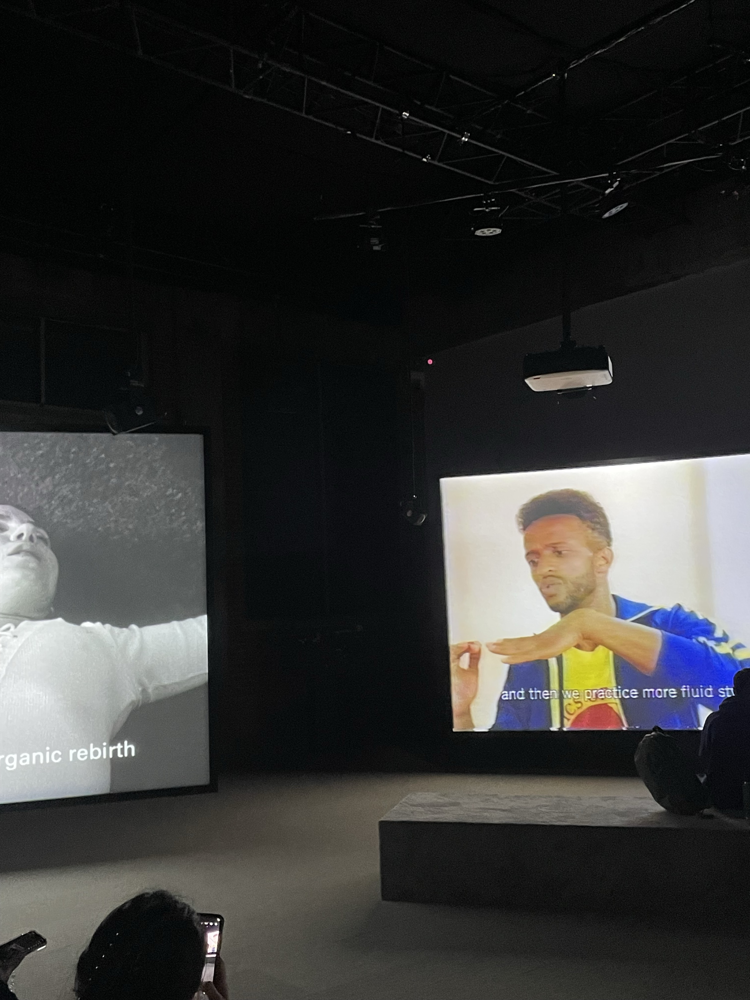

# Jeremy Shaw

*Phase Shifting Index*

INFORMATION SUR L'EXPOSITION - DATE DE VISITE 02/02/2024

L'exposition de Jeremy Shaw peut être retrouver à MAC, à la Fonderie Darling. Phase Shifting Index est une installation permanante qui se retrouve aussi à l'interieur. De type immersive par son ambiance sombre , mais aussi par ses nombreux haut-parleurs qui te permettent vraiment de te faire engloutir dans le message que l'artise a voulut communiquer.

C'est une grande expérience, de style psychédélique, où tu peux voir des vidéos sur sept écrans en même temps. Ces vidéos montrent des groupes de personnes entrain de faire des mouvements étranges, mais toutes différentes à la fois, comme s'ils étaient dans une sorte de thérapie des années 60 au années 90. L'artiste, Shaw, veut nous faire réfléchir sur la manière dont ces mouvements peuvent changer notre façon de voir le monde. Il utilise des images d'archives et des effets spéciaux pour créer une histoire fascinante qui se termine par une grande danse collective.

Voilà pour la présentation de l'oeuvre

**Mise en Espace**

Croquis

Salle D'accueil

Salle d'exposition

Il y a deux salles, toutes les deux rectangulaires. Pour la première nous devons retirer nos chaussures pour nous preparer à rentrer dans la salle actuelle de l'exposition. Le sol de la première salle était de texture lisse. Plusieurs photos recouvraient entierement les murs. De par cela, c'etais des photos d'une protestation du style des années 60 à 90. Au milieux de la salle, il y a un pilier de pierre entourré d'un banc où tu peux t'assoire.

La deuxième salle était d'un sol tapissé qui etait agréable à marcher dessus, comparé au sol de la salle précédente. Dans cell-ci, 7 écrans disposés au milieu de la salle, projectant chacune une vidéo qui semble de différente époque. D'un coter de la salle se trouvait des bancs en "escaliers" recouvert de tapis, donnant une vue plus élever au spectateur.

